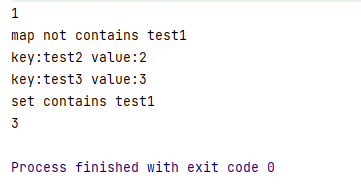

= Отчет по лабораторной работе 2
:listing-caption: Листинг
:source-highlighter: coderay

Студент: Рябков Владислав Алексеевич

Группа: ПИМ-22

== 1. Постановка задачи

В процессе выполнения лабораторной работы необходимо выполнить следующие задачи:

1. ООП. 
    - Создать интегрфейс
    - Создать абстрактный класс
    - Создать класс, имплементирующий интерфейс
    - Создать класс-наследник абстрактного класса

2. Reflection
    - Выгрузить все поля и методы класса с помощью рефлексии
    - Вызвать несколько методов класса
    - Вывести на экран всех предков класса

3. Collections
    - Ознакомится со всеми коллекциями java (list, set, map) и их реализацией
    - Продемонстрировать в программе работу с каждым видом реализации коллекции (list, set, map)

4. Generics
    - Сделать дженерик на класс
    - Сделать дженерик на метод

== 2. Разработка задачи

=== 2.1 Структура проекта

Проект разделен на следующие директории:

/src:::
Директория с исходным кодом лабораторной работы

/result:::
Отчет по проделанной работе

== 3. Информация о реализации

=== 3.1 Задание 1

Для выполнения первого задания создан пакет oop, в котором 4 класса TestInteface, TestAbstactClass, ImplementInterface, ExtendClass.

Созданный интерфейс:

.TestInteface
[source,java]
----
package oop;

public interface TestInterface {

    public boolean test();
}
----

Созданный абстрактный класс:

.TestAbstractClass
[source,java]
----
package oop;

public abstract class TestAbstractClass {

    private String name;

    public String getName() { return name; }
}
----

Класс, который имплементирует интерфейс:

.ImplementInterface
[source,java]
----
package oop;

import java.util.Random;

public class ImplementInterface implements TestInterface{
    @Override
    public boolean test() {
        return new Random().nextBoolean();
    }
}

----

Класс, который наследует абстрактный класс:

.ExtendClass
[source,java]
----
package oop;

public class ExtendClass extends TestAbstractClass {
    public void write() {
        System.out.println(getName());
    }
}
----

=== 3.2 Задание 2

Для выполнения этого задания добавим в проект пакет reflection, в котором поместим классы Class1, Class2, Class3 для демонстрации работы рефлексии и непосредственно класс TestRefclection, в котором будет код для решения поставленных задач.

.Class1
[source,java]
----
package reflection;

public class Class1 {
    private String string1 = "test1";
    private final String string11 = "test2";

    public String getString1(){
        return string1;
    }

    public void setString1(String str){
        string1 = str;
    }
}
----

.Class2
[source,java]
----
package reflection;

public class Class2 extends Class1 {
    public String string2;
}
----

.Class3
[source,java]
----
package reflection;

public class Class3 extends Class2 {
    public String string3;
}
----

.TestReflection
[source,java]
----
package reflection;

import java.lang.reflect.Field;
import java.lang.reflect.Method;

public class TestReflection {

    public static void main(String[] args) {
        System.out.println("Выгрузить все поля и методы класса с помощью рефлексии Class1");
        fieldsAndMethods();
        System.out.println("Вызвать несколько методов класса Class1");
        invokeMethods();
        System.out.println("Вывести на экран всех предков класса Class3");
        writeSuperClasses();
    }

    public static void fieldsAndMethods() {
        try {
            Class c = Class.forName(Class1.class.getName());
            Field f[] = c.getDeclaredFields();
            for (int i = 0; i < f.length; i++)
                System.out.println(f[i].toString());

            Method m[] = c.getDeclaredMethods();
            for (int i = 0; i < m.length; i++)
                System.out.println(m[i].toString());
        } catch (Throwable e) {
            System.err.println(e);
        }
    }

    public static void invokeMethods() {
        try {
            Class c = Class.forName(Class1.class.getName());
            Class1 class1 = new Class1();

            Method meth = c.getMethod("getString1");

            Object res = meth.invoke(class1);
            String stringRes = (String) res;
            System.out.println(stringRes);

            Method meth2 = c.getMethod("setString1", String.class);
            meth2.invoke(class1, "changed by reflection");

            res = meth.invoke(class1);
            stringRes = (String) res;
            System.out.println(stringRes);
        } catch (Throwable e) {
            System.err.println(e);
        }
    }

    public static void writeSuperClasses() {
        try {
            Class c = Class.forName(Class3.class.getName());
            Class sClass = c.getSuperclass();
            while (sClass != null) {
                System.out.println(sClass.getName());
                c = sClass;
                sClass = c.getSuperclass();
            }
        } catch (Throwable e) {
            System.err.println(e);
        }
    }
}
----

=== 3.3 Задание 3

Для выполнения третьего задания был создан пакет collections и класс TestCollections для реализации.

.Класс TestCollections
[source,java]
----
package collections;

import java.util.*;

public class TestCollections {
    public static Map<String, Integer> testMap = new HashMap<>();
    public static Set<String> testSet = new HashSet<>();
    public static List<Integer> testList = new ArrayList<>();

    public static void main(String[] args) {
        testMap.put("test1", 1);
        testMap.put("test2", 2);
        testMap.put("test3", 3);
        if (testMap.containsKey("test1")) {
            System.out.println(testMap.get("test1"));
        } else {
            System.out.println("map not contains test1");
        }
        testMap.remove("test1");
        if (testMap.containsKey("test1")) {
            System.out.println(testMap.get("test1"));
        } else {
            System.out.println("map not contains test1");
        }

        testMap.forEach((s, integer) -> System.out.println("key:" + s + " " + "value:" + integer));

        testSet.add("test1");
        testSet.add("test2");
        testSet.add("test3");

        if (testSet.contains("test1")) {
            System.out.println("set contains test1");
            testList.add(3);
            testList.add(2);
            testList.add(1);
        }

        if (!testList.isEmpty()) {
            if (testList.get(2) == 1) {
                System.out.println(testList.get(0));
            }
        }
    }
}
----

=== 3.4 Задание 4

Для выполнения четвертого задания был создан пакет genereics с классами - Account, который предаствляет из себя Generic класс. А также TestGeneric, в котором присутствует пример использования класса Account, а также пример genereic метода fromArrayToList.

.Файл Account
[source,java]
----
package generics;

class Account<T>{

    private T id;
    private int sum;

    Account(T id, int sum){
        this.id = id;
        this.sum = sum;
    }

    public T getId() { return id; }
    public int getSum() { return sum; }
    public void setSum(int sum) { this.sum = sum; }
}
----

.Файл TestGeneric
[source,java]
----
package generics;

class Account<T>{

    private T id;
    private int sum;

    Account(T id, int sum){
        this.id = id;
        this.sum = sum;
    }

    public T getId() { return id; }
    public int getSum() { return sum; }
    public void setSum(int sum) { this.sum = sum; }
}
----

== 4. Результаты выполнения

В результате выполнения лабораторной работы получены следующие пакеты.

oop с классами TestInterface, TestAbstractClass, ImplementInterface, ExtendClass - задание из раздела ООП

reflection с классами Class1, Class2, Class3, TestReflection - задание из раздела Reflection

collections с классом TestCollections - задание из раздела Collections

generics с классами Account, TestGeneric - задание из раздела Generics

Часть заданий могут являются исполняемыми.

Результат запуска TestReflection

Результат запуска TestCollections

Результат TestGeneric

== 5. Вывод

В результате выполнения лабораторной работы получены навыки по работе с ООП в java. Изучена работа с Reflection API, Collections, Generics. Получен практический опыт в работе с данными технологиями.